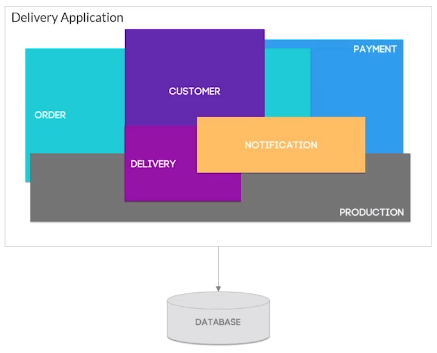
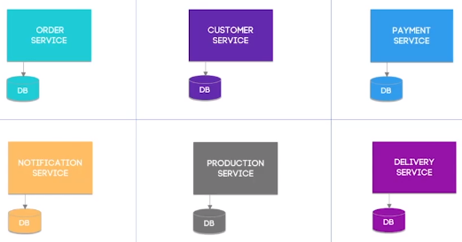
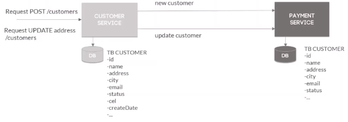
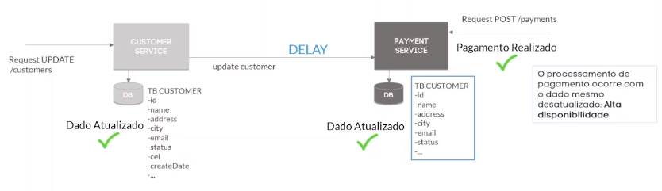
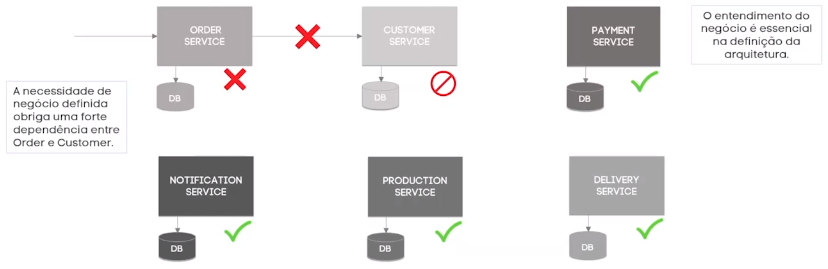
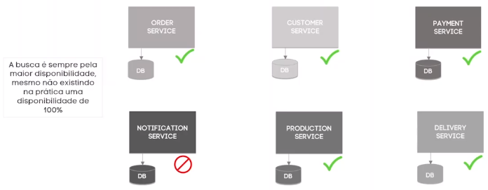

# Fundamentos dos Microservices

### Representação arquitetura monolítica

* Serviços aglomerados em uma única aplicação

* Único banco de dados (único ponto de falha)

### Representação arquitetura de microsserviços

* Serviços distribuídos e independentes

* Banco de dados para cada aplicação

### Fundamentos

* Envolve desde conceitos técnicos, financeiras e gerenciais moldados principalmente sobre a necessidade do negócio

* A mudança de paradigma para microsserviços requer também uma mudança equivalente na estrutura da organização. Não só uma questão técnica. É também cultural e organizacional

* É um subconjunto dos conceitos de sistemas distribuídos modernos

### Sincronia de dados em sistemas distribuídos

* **IMPORTANTE**: não há como garantir alta disponibilidade com consistência forte ao mesmo tempo em uma arquitetura de microsserviços com dados distribuídos

  > **Consistência de dados**: garantir a integridade dos dados, sem divergência e nem ambiguidade de dados dentro da aplicação
   

### Disponibilidade VS Consistência forte

> **Teorema CAP**

* Para garantir a alta disponibilidade em sistemas distribuídos com dados compartilhados é necessário a sincronia de dados de forma assíncrona e não bloqueante, gerando uma **consistência eventual**

  > **Consistência eventual**: os dados podem estar momentaneamente desatualizados ou não replicados ao serem consultados

* **Exemplo**

  

### UUIDs

* Meio de criar dados com identificadores únicos afim de evitar conflitos/ambiguidades

* **OBS**: no contexto de microsserviços, identificados sequenciais não é uma boa abordagem

  

* São identificadores temporais universalmente exclusivos e essenciais para a sincronia de dados distribuídos

* **Vantagens**

  * Geração simples

  * Fácil replicação de dados

  * Garantia de uma maior manutenibilidade

  * Únicos em qualquer base de dados

### Acoplamento em microsserviços

* **Não** existe desacoplamento absoluto entre os microsserviços, entretanto é possível ter um **baixo acoplamento**

* **Exemplo**

  

### Disponibilidade em microsserviços

* **OBS**: não existe 100% de disponibilidade, pois sempre existirá alguma dependência entre os serviços da aplicação

* **Exemplo**

  

### Distribuição das bases de dados em microsserviços

* É possível ter compartilhamento de bancos de dado entre serviços

* **OBS**: é comum essa prática no início do processo de migração de monolito para microsserviço

### Padrões de microsserviços

> É fundamental durante a elaboração de uma aplicação de microsserviços

* 1 base de dado por serviço

  * **Vantagem**: diminui o acoplamento 

  * **Desvantagem**: é necessário saber lidar corretamente com os **dados distribuídos** (sincronização de dados e com a consistência eventual)
