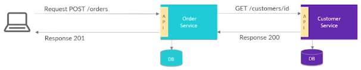
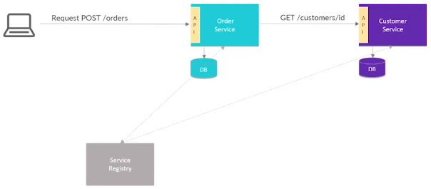
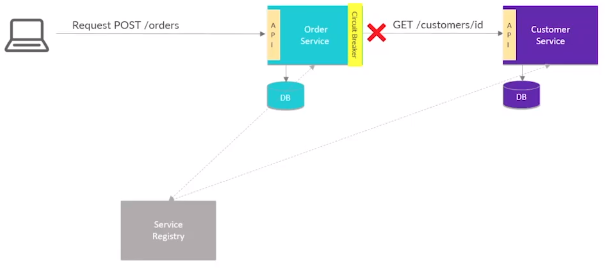
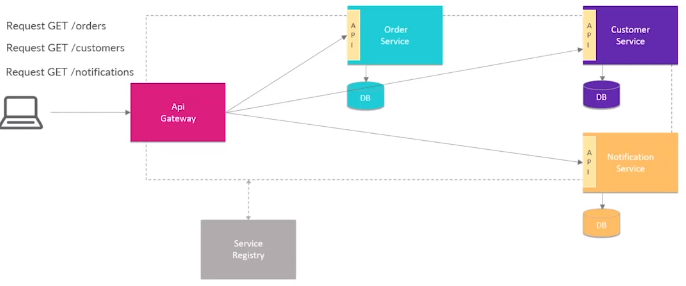

# Microservices Patterns e Spring

### Shared Database Pattern

* Compartilhamento de banco de dados entre serviços

* Muito comum na migração de um aplicações monolíticas para microsserviços

* **Projetos Springs**

  * Spring Data (JPA, JDBC, MongoDB, etc)

### Database per Service Pattern

* 1 banco de dados por serviço

* Consequência: dados distribuídos (requer uma comunicação entre os microsserviços)

* **Projetos Springs**

  * Spring Data (JPA, JDBC, MongoDB, etc)

### Comunicação

* Synchronous communication (comunicação síncrona)

  * **Request <-> Response**

  * Via REST API

    

    * Comunicação utilizando o protocolo HTTP

    * **Projetos Springs**

      * Spring Web (RESTful e Spring MVC)

      * Spring WebFlux (APIs reativas)

      * Spring HATEOAS (links relacionados em endpoints)

      * Spring Validation (validações)

* Asynchronous communication (comunicação assíncrona)

### Services Registry/Discovery

* Monitoramento dos endereços/instâncias de cada serviço registrado nele, afim de fornecer essas informações para os serviços que necessitam disso. Além disso, o *Service Registry* faz o balanceamento de carga entre as instâncias de cada serviço, sempre buscando a melhor instância do serviço para processar essa requisição.

* É uma "preocupação transversal" na arquitetura de microsserviços

  > Preocupação transversal: são pontos envolvendo vários serviços dentro da arquitetura. Exemplos: Service Registry, configurações externas e segurança

* **Projetos Springs**

  * Spring Cloud Netflix Eureka

  * Spring Cloud Consul

### Circuit Beaker

* Prevenir falhas em cascatas na arquitetura de microsserviços

  > Falhas em cascatas: caso um serviço esteja fora do ar, sem um *circuit beaker*, as próximas requisições falharão e o mecanismo de retentativa reenviará essas requisições, dessa forma, sobrecarregando o servidor

* Garantir a resiliência e uma tratativa eficiente

* Também atua na política de retentativa

> É necessário implementar o método `fallback`

* 3 estados no *circuit breaker*

  * Fechado: quando o *circuit breaker* nota um serviço fora do ar (serviço com falhas)

  * Meio aberto: quando o *circuit breaker* nota uma possível retomada/recuperação do serviço

  * Aberto: quando o *circuit breaker* nota um serviço no ar

* **Projetos Springs**

  * Spring Cloud

  * Resilience4J

### API Gateway Pattern

* Centralizar a entrada externa afim de evitar a exposição desnecessário de serviços

* Realiza os roteamentos (redirecionamento) e filtros

* É responsável pelo balanceamento de carga, por estar conectado com o *Service Registry*

  > OBS: a *API Gateway* é um cliente do *Service Registry* por estar registrado nele

* **Projetos Springs**

  * Spring Cloud Gateway (tem suporte para APIs reativas)

### API Composition Pattern